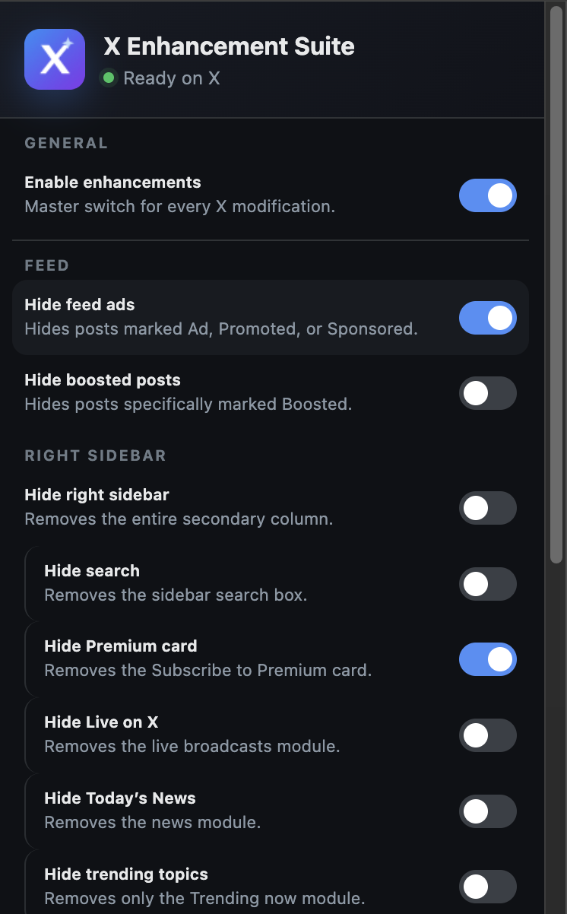

# X Enhancement Suite

An experimental, dev-mode-only Manifest V3 Chrome extension for making
personal DOM and style changes on [X](https://x.com).

<p align="center">
  
</p>

It provides independent feed, sidebar, and navigation controls; a synchronized
blocked-keyword list; and custom CSS. Every built-in DOM change is reversible
without deleting X's content.

## Feature reference

The toolbar popup is the main control surface. Changes apply immediately to
open X tabs, including content that X adds later while navigating or scrolling.
The defaults below apply to a new installation or after **Reset all settings**.

### General

| Control | Default | Behavior |
| --- | --- | --- |
| **Enable enhancements** | On | Master switch for all built-in filters and custom CSS. Turning it off restores X's original presentation while preserving the saved individual settings. |

### Feed

| Control | Default | Behavior |
| --- | --- | --- |
| **Hide feed ads** | On | Hides complete feed posts marked `Ad`, `Promoted`, or `Sponsored`. |
| **Hide boosted posts** | On | Independently hides complete posts specifically marked `Boosted`. It does not depend on the feed-ad setting. |
| **Hide Who to Follow from feed** | Off | Removes the complete inline account-recommendation module, including its heading, suggested accounts, and “Show more” row. It does not affect the separate sidebar module. |
| **Hide new-posts popup** | Off | Removes the blue scroll-to-top notice that overlays the feed when X detects new posts. Ordinary feed controls remain visible. |
| **Hide analytics promotions** | Off | Removes X Premium cards such as “Access your post analytics” from feeds and post-detail views without hiding the surrounding post. |
| **Hide posts with keywords** | On | Hides complete feed posts that match the saved blocked-keyword list. Turning the toggle off restores matching posts without deleting the list. |

Click **Edit blocked keywords** beneath the keyword toggle to open the dedicated
list manager. It supports:

- Adding and removing individual keywords or phrases
- Clearing the entire list
- Up to 100 entries, with a maximum of 64 characters per entry
- Unicode-normalized substring matching
- Case-insensitive matching by default
- An optional **Case-sensitive matching** toggle for the whole list
- Immediate re-evaluation of posts when the list or either keyword toggle
  changes

Keyword matching checks the visible post text and quoted-post text identified by
X's `tweetText` elements. It does not match usernames, account display names, or
interface labels. Filtering is limited to feeds; opening an individual
`/username/status/id` conversation leaves that post and its replies visible.

### Right sidebar

| Control | Default | Behavior |
| --- | --- | --- |
| **Hide right sidebar** | Off | Removes the entire secondary column without changing the primary feed width. |
| **Hide search** | Off | Removes the sidebar search box. |
| **Hide Premium card** | On | Removes the “Subscribe to Premium” sidebar card. |
| **Hide Live on X** | Off | Removes the live-broadcasts module. |
| **Hide Today’s News** | Off | Removes the news module. |
| **Hide trending topics** | Off | Removes only the “Trending now” module rather than the entire sidebar. |
| **Hide Who to follow** | Off | Removes the complete sidebar account-recommendation panel. |
| **Hide sidebar ads** | On | Removes display-ad placements from the sidebar. |
| **Hide footer links** | Off | Removes the sidebar footer containing X's legal and informational links. |

The granular sidebar controls remove their complete layout slots, including
borders and spacing, so hidden modules do not leave gray divider lines behind.
Their saved values remain available when the whole-sidebar switch is enabled.

### Navigation

| Control | Default | Behavior |
| --- | --- | --- |
| **Hide Premium link** | Off | Removes Premium from X's primary navigation. |
| **Hide Grok link** | Off | Removes Grok from X's primary navigation. |

### Custom CSS, synchronization, and reset

Click **Custom CSS** in the popup to open the CSS editor. Saved rules run only
on X while the master switch is enabled. The editor accepts up to 7,000
characters and is intended for personal styles that are too specific to become
built-in controls.

Chrome Sync stores the toggle settings, custom CSS, case-sensitivity preference,
and blocked-keyword list. The extension uses no external service for those
settings. **Reset all settings** in the Custom CSS page restores every toggle
to the defaults listed above, clears custom CSS, and clears the blocked-keyword
list.

## Install locally

1. Clone this repository.
2. Open `chrome://extensions` in Chrome.
3. Turn on **Developer mode**.
4. Click **Load unpacked**.
5. Select this repository's root directory.
6. Pin **X Enhancement Suite** from Chrome's Extensions menu.

After changing extension source files, click the extension's reload button on
`chrome://extensions`, then refresh any open X tabs. Reloading the X page
without first reloading the extension will continue to use the old extension
code.

## Maintainer and AI-agent guide

Read this section before changing the extension. X is a frequently changing
single-page application, so a selector that hides the right text can still be
wrong if it leaves a border, margin, empty wrapper, or unrelated sibling
hidden.

### Repository map

| Path | Responsibility |
| --- | --- |
| `manifest.json` | Manifest V3 metadata, permissions, entry points, and version |
| `src/shared/settings.js` | Defaults, popup toggle definitions, validation, and migrations |
| `src/shared/dom-rules.js` | Pure label-classification helpers |
| `src/content/content.js` | Root attributes, DOM discovery, markers, and MutationObserver |
| `src/content/content.css` | Built-in visual rules gated by root attributes |
| `src/popup/` | Generated toggle UI and settings updates |
| `src/keywords/` | Blocked-keyword list management page |
| `src/options/` | Custom CSS editor and reset UI |
| `test/` | Dependency-free Node regression tests |
| `scripts/cdp.mjs` | Evaluate JavaScript in the isolated debug X tab through CDP |
| `scripts/live-matrix.js` | Live browser regression matrix for every built-in toggle |
| `scripts/package.mjs` | Build the versioned ZIP in `dist/` |

The project intentionally has no runtime or development dependencies. Node.js
20 or newer is recommended.

### How settings become DOM changes

The normal path for a built-in toggle is:

1. Add its default and UI definition to `src/shared/settings.js`.
2. Map the setting to a `data-xes-*` root attribute in
   `ROOT_ATTRIBUTE_BY_SETTING` in `src/content/content.js`.
3. If CSS cannot identify the complete target safely, discover it in the
   content script and add a stable `data-xes-*` marker.
4. Add a CSS rule gated by both `data-xes-enabled="true"` and the setting's root
   attribute.
5. Add Node regression coverage and extend `scripts/live-matrix.js`.

The popup is generated from `TOGGLE_DEFINITIONS`; do not hand-code another copy
of a toggle in the popup HTML. `normalizeSettings()` deliberately strips
unknown keys and invalid value types. Add a migration there when renaming or
splitting a previously stored setting.

Blocked keywords deliberately use their own Chrome Sync key instead of the
general settings object. This keeps the list independent of the custom-CSS
payload and below Chrome Sync's per-item quota. Use
`normalizeBlockedKeywords()`, `getBlockedKeywords()`, and
`setBlockedKeywords()` rather than reading or writing that storage item
directly.

Content transformations must be idempotent. X inserts, removes, and reuses DOM
nodes during navigation and scrolling, and `scanForEnhancements()` may see the
same area repeatedly.

### Selector and layout rules

- Prefer stable accessibility attributes, semantic elements, link paths, and
  `data-testid` values. Do not depend on X's generated `r-*` or `css-*` class
  names.
- Match paid-content labels exactly. A post marked `Ad`, `Promoted`, or
  `Sponsored` is classified separately from one marked `Boosted`.
- Scope feed rules to `article[data-testid="tweet"]`.
- Identify the new-posts popup by its dedicated accessibility label, then mark
  and hide its complete positioned overlay wrapper. Do not match generic
  visible text such as `posted`.
- X renders inline “Who to follow” as consecutive timeline cells: a heading,
  one or more `UserCell` rows, and a final “Show more” link. Mark every bounded
  cell in that sequence and stop before the following post.
- Identify the post-analytics promotion by both its exact heading and its
  `/i/account_analytics` action. Hide the complete card margin wrapper, not the
  surrounding post. Keep the marker-independent `:has()` fallback so an
  asynchronous marker race cannot leave the card visible.
- Keyword matching is Unicode-normalized substring matching against descendants
  with `data-testid="tweetText"`. It is case-insensitive by default, with a
  global case-sensitive option on the management page. Mark and hide the
  complete `cellInnerDiv`; never hide only the inner article.
- Do not apply keyword filtering on `/username/status/id` routes. The feature
  is for feeds, not individual post-detail conversations.
- Scope sidebar rules to `[data-testid="sidebarColumn"]`.
- Hide the complete sidebar slot, not merely its inner `<aside>`, `<section>`,
  or heading. Hiding only the semantic child leaves X's rounded border or a
  gray 1–2px divider behind.
- `sidebarSlotFor()` finds the direct module slot in X's sidebar stack, and
  `markSidebarItems()` labels it with `data-xes-sidebar-item`. Add new granular
  sidebar controls through this mechanism.
- A hidden sidebar slot must have `display: none` and a measured bounding box of
  `0 × 0`. Verify that every sibling module remains visible.
- The whole-sidebar rule must not style `[data-testid="primaryColumn"]`; hiding
  the sidebar must leave feed width unchanged.
- Keep all built-in CSS behind the master `data-xes-enabled="true"` gate so the
  master switch restores the original page.
- Do not remove X nodes permanently. Mark them and use gated CSS so toggles can
  take effect immediately without reloading.

### Change checklist

For a normal feature or selector repair:

1. Inspect the current X DOM in the isolated debug browser.
2. Capture the target's ancestor chain, computed display, border, margin, and
   bounding rectangle before writing a selector.
3. Update the smallest relevant settings, content, CSS, and test files.
4. If behavior changes, bump the version in both `manifest.json` and
   `package.json`.
5. Run `npm run check`.
6. Reload the unpacked extension in the isolated browser and refresh X.
7. Run `npm run live-test`.
8. Test popup-to-page settings propagation and Custom CSS when those paths
   changed.
9. Run `npm run package` and verify the generated archive.
10. Check `git diff --check`, preserve unrelated work, commit only relevant
    files, push, and confirm the local and remote commit IDs match.

Do not call a feature fixed merely because its inner target reports
`display: none`. Check its outer layout slot and nearby siblings.

## Isolated Chrome debugging

All automated or agent-driven X inspection must use a separate Chrome for
Testing process. Do not attach DevTools automation to the user's everyday
Chrome, activate that browser, switch its tabs, or launch URLs into it.

The established setup uses:

- Chrome for Testing rather than the normal Google Chrome application
- A distinct cloned `--user-data-dir`, usually named
  `/tmp/xes-chrome-debug.*`
- A cloned profile that is already authenticated to X
- Remote debugging on port `9229`
- Headless mode so the process does not steal window focus
- This repository as the only enabled unpacked extension

The Chrome for Testing download has previously lived under
`/tmp/xes-chrome-for-testing/`. Both that location and the debug-profile path
are temporary conventions, not committed dependencies; discover or recreate
them when absent.

### Clone a profile safely

Never point two Chrome processes at the same user-data directory. The debug
browser must use a copy.

On macOS, the safest one-time clone is made while normal Chrome is fully quit.
Do not terminate the user's Chrome without permission. If the user needs to
keep working and an authenticated clone already exists, reuse that clone. If
none exists, ask the user to close Chrome briefly or create a fresh debug
profile and sign in to X once.

Example for the `Default` profile:

```sh
XES_SOURCE_ROOT="${HOME}/Library/Application Support/Google/Chrome"
XES_DEBUG_PROFILE="$(mktemp -d /tmp/xes-chrome-debug.XXXXXX)"

mkdir -p "${XES_DEBUG_PROFILE}/Default"
ditto "${XES_SOURCE_ROOT}/Local State" "${XES_DEBUG_PROFILE}/Local State"
ditto "${XES_SOURCE_ROOT}/Default" "${XES_DEBUG_PROFILE}/Default"
chmod -R go-rwx "${XES_DEBUG_PROFILE}"
```

Change `Default` consistently if the source profile is named `Profile 1`,
`Profile 2`, and so on. Copying a live profile can produce an inconsistent
Cookies database. A fresh debug-only profile with a one-time X login is the
fallback if cloned authentication does not work.

A profile clone contains session cookies and other sensitive browser data:

- Keep it outside the repository.
- Never commit, upload, print, or inspect cookie values.
- Do not reuse it for unrelated browsing.
- Stop the debug process when testing finishes.
- Do not delete a reusable clone unless the user asks; when deletion is
  authorized, delete only the exact validated clone path.

### Launch the background debug browser

Set the binary and profile paths to the local copies:

```sh
XES_REPO="$(pwd)"
XES_CHROME_BIN="/tmp/xes-chrome-for-testing/chrome-mac-x64/Google Chrome for Testing.app/Contents/MacOS/Google Chrome for Testing"
XES_DEBUG_PROFILE="/tmp/xes-chrome-debug.REPLACE_ME"

"${XES_CHROME_BIN}" \
  --user-data-dir="${XES_DEBUG_PROFILE}" \
  --profile-directory=Default \
  --remote-debugging-address=127.0.0.1 \
  --remote-debugging-port=9229 \
  --remote-allow-origins=http://127.0.0.1:9229 \
  --headless=new \
  --window-size=1800,1200 \
  --force-device-scale-factor=1 \
  --disable-gpu \
  --disable-sync \
  --no-first-run \
  --no-default-browser-check \
  --disable-extensions-except="${XES_REPO}" \
  --load-extension="${XES_REPO}" \
  https://x.com/home
```

Keep that process running in its own terminal session. Stop it with `Ctrl-C`
after testing. Do not use AppleScript, `open -a "Google Chrome"`, or other
commands that can focus the user's normal browser.

If the extension source changes, stop and relaunch this isolated process so
Chrome reloads the unpacked extension, then refresh the X target before
retesting.

### Inspect X through CDP

Confirm the debug browser and authenticated X tab:

```sh
curl -s http://127.0.0.1:9229/json/list
npm run cdp -- '({ title: document.title, url: location.href })'
```

`scripts/cdp.mjs` selects the first page target whose URL starts with
`https://x.com/`. Override the defaults when needed:

```sh
CDP_PORT=9231 npm run cdp -- 'document.title'
CDP_URL_PREFIX='chrome-extension://EXTENSION_ID/' \
  npm run cdp -- 'document.body.innerText'
```

For longer probes, save a JavaScript expression in a file and run:

```sh
npm run cdp -- --file probe.js
```

Avoid selectors that only assert that an inner element disappeared. Useful live
probes should also capture:

- `getComputedStyle(element).display`
- `getBoundingClientRect()` width and height
- border widths and margins on ancestors
- whether unrelated sidebar siblings remain visible
- primary-feed width before and after hiding the whole sidebar

### Run the live regression matrix

With an authenticated X tab open in the isolated browser:

```sh
npm run live-test
```

The matrix currently checks all built-in controls: eight granular sidebar
slots, whole-sidebar behavior, the master switch, Premium and Grok navigation,
independent Ad/Boosted classification and filtering, every cell in an inline
“Who to follow” module without affecting the sidebar or following post, the
new-posts popup without affecting ordinary feed controls, the post-analytics
promotion without affecting its surrounding post, complete-cell keyword
filtering without affecting an unmarked post, and continued absence of Compact
timeline. It restores the page's original extension attributes and removes its
synthetic feed fixtures in a `finally` block.

Feed tests use temporary synthetic Ad and Boosted posts so the result does not
depend on what X happens to serve during a particular session. Sidebar tests
use the real authenticated X DOM because wrapper structure is the behavior
under test.

If extension popup or options pages are also open as CDP targets, close them
before timing-sensitive X tests. Chrome may throttle timers in background page
targets.

## Automated checks and packaging

Run the complete non-browser check:

```sh
npm run check
```

Or run individual commands:

```sh
npm test
npm run validate
node --check src/content/content.js
```

Create and verify a distributable archive:

```sh
npm run package
unzip -t "dist/x-enhancement-suite-v$(node -p "require('./package.json').version").zip"
```

The unpacked repository remains the easiest installation method. `dist/` is
ignored by Git.

## Privacy and permissions

The extension runs only on `x.com` and `twitter.com`. It requests Chrome's
`storage` permission solely to persist extension settings, custom CSS, and the
blocked-keyword list. It does not make network requests, collect analytics, or
transmit browsing data.

The isolated debug profile is separate from extension behavior but is still
sensitive because it may contain cloned browsing data and authenticated
sessions.

## Project status

This project is intended for personal use and is not affiliated with X Corp.
When X changes its markup, repair selectors using the isolated inspection and
live-matrix workflow above.
